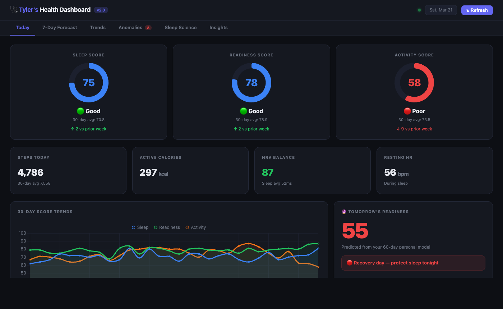

# 🩺 Oura Claude Dashboard v2.0

A personal health intelligence dashboard for Oura Ring — built with Claude.

Goes way beyond the Oura app with features no other tool has:

### v2.0 — Sleep Science
- **Sleep Cycle Explainer** — visualizes your actual hypnogram (deep/light/REM/awake) with heart rate overlay, so you can *see* your sleep architecture, not just a score
- **Deep Sleep Decoder** — compares your top 25% vs bottom 25% deep sleep nights to discover *your* personal deep sleep triggers (steps, bedtime, stress, alcohol)
- **Tonight's Sleep Plan** — a coaching card with 2 specific actions you can take *tonight* to optimize tomorrow's recovery

### v1.0 — Core Analytics
- **7-Day Readiness Forecast** — predicts your readiness score for the next week based on your personal 60-day patterns
- **Anomaly Detector** — flags days where metrics crashed and auto-detects likely causes
- **Personal Correlations** — discovers relationships unique to *your* biology (does alcohol wreck *your* deep sleep? do steps improve *your* recovery?)
- **Sleep Debt Tracker** — running 30-day cumulative deficit with payback estimate
- **60-Day Heatmap** — visual history of every readiness score
- **Lifestyle Experiment Logger** — nightly check-in that builds your personal sleep model over time



---

## Setup (2 minutes)

### 1. Get your Oura token
Go to [cloud.ouraring.com/personal-access-tokens](https://cloud.ouraring.com/personal-access-tokens) and create a Personal Access Token.

### 2. Configure
```bash
cp .env.example .env
# Edit .env and paste your token
```

### 3. Run the dashboard
```bash
./run.sh
```

Then open [http://localhost:7891](http://localhost:7891) in your browser.

---

## What's included

| File | What it does |
|------|-------------|
| `dashboard/server.py` | Local API server — proxies Oura API, computes correlations + forecast + sleep decoder |
| `dashboard/index.html` | The dashboard UI (6 tabs: Today, Forecast, Trends, Anomalies, Sleep Science, Insights) |
| `health_monitor.py` | Daily health report (run manually or via scheduler) |
| `insights_engine.py` | Deep 60-day pattern analysis — run anytime for full report |
| `evening_checkin.py` | Nightly lifestyle logger — builds your personal sleep model |

---

## Running the CLI tools

```bash
# Full 60-day pattern analysis
source .env && python3 insights_engine.py

# Daily health snapshot
source .env && python3 health_monitor.py

# Log tonight's lifestyle factors (pipe in JSON)
echo '{"alcohol": false, "late_meal": false, "screen_time_late": true, "stress_level": 2, "exercise": true, "caffeine_after_2pm": false}' \
  | source .env && python3 evening_checkin.py
```

---

## Requirements

- Python 3.8+ (no external packages — stdlib only)
- An Oura Ring with API access

---

## How the forecast works

The 7-day readiness forecast is built from:
1. **Day-of-week baselines** — your historical average readiness for each day of the week
2. **Recent trend** — whether your readiness is improving or declining over the last 7 days vs prior 7
3. **HRV momentum** — whether your HRV balance is trending up or down
4. **Activity load** — high recent activity suppresses next-day readiness

The model is personalized — it uses *your* 60-day history, not population averages.

---

## How the Deep Sleep Decoder works

The decoder splits your last 60 nights into top 25% and bottom 25% by deep sleep duration, then compares the conditions across those nights:

- **Steps** — did you move more on your best deep sleep days?
- **Bedtime** — is there an optimal window for *your* chronotype?
- **Calories burned** — does higher activity drive deeper sleep?
- **Restlessness** — do restless nights predict each other?

Each finding is translated into a plain-English action: *"Your best deep sleep nights happened when you hit 8,400+ steps."*

---

## Privacy

Your Oura token lives only in your local `.env` file. The dashboard runs entirely on your machine. No data is sent anywhere except to the official Oura API.

---

Built with [Claude](https://claude.ai) + the Oura API.
